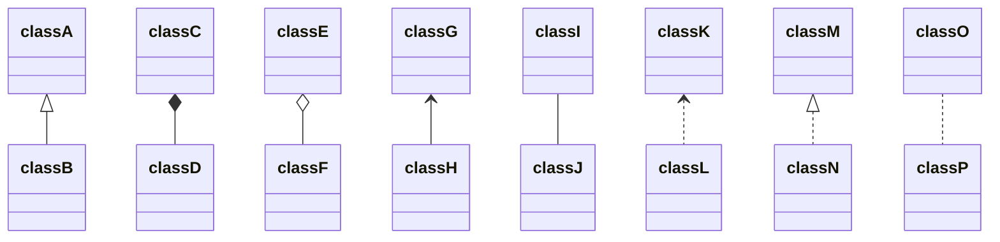

### NINJA Application (ninja+fixappframework)
```cpp
//Application.cpp
Application app;
app.init();
app.run();
app.sendMsg("router_branch012", "exch_sim012", &order);
app.stop();
```

//NINJATradeClient.cpp 封装一层:结构同上


//fixappframework
NinjaBuzzManager::build
auto sessId = ninjaClient()->getSession(senderId, targetId, this);
class NinjaMsgListener : public NINJA::MsgHandlerImpl
class NinjaBuzzManager:   Noncopyable, public NinjaMsgListener //联系全局的类NinjaBuzzManager
NinjaMsgListener::OrderAck
MsgHelper::createOrderAccepted
```

### sor
通过搜索NinjaBuzzManager即可查看联系
```cpp
//RequestListener.cpp发送
RequestListener::onNewOrder
RequestListener::processNewOrder
QRequestManager::processMessage
RequestListener::processNewOrder
onNewOrderOrig(msg);
submitMarketOrder(norder);/submitLimitOrder(norder);
FSX::Ninja::NinjaBuzzManager::instance().enterOrder(norder);
OSessions::sendToNinja(msg)

//ResponseListener.cpp接收
Application::onMessage
NINJATradeClient::OnOrderAck
NinjaMsgListener::OrderAck
MsgHelper::createOrderAccepted(msg, m);
NinjaBuzzManager::onOrderAccepted
ResponseListener::onNewOrderAccepted
ResponseListener::processOrderAccepted
ResponseListener::backwardFromME
//MessageListener::setGateway//BackListener::setGateway
//FsxApplication::setResponseListener//gapp.setAppSettings(appSettings);
//FsxApplication::run
this->getGateway()->backward(m);
GatewayImpl::backward
sendToTarget(msg,true);
```

### clientgateway(CGW)
类似sor的代码结构
